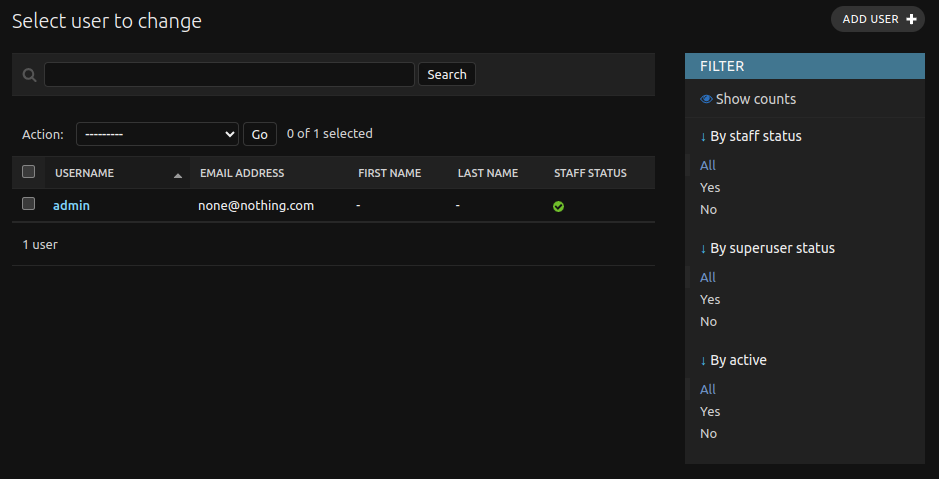

# Django Admin Page

The Django administration page can be accessed by going to `http://<webapp_url>/admin`. Only users with "staff" level access are able to log into it.

## Adding or Deleting Users

To add or delete users from the webapp, click in "Users". Here you will be presented with a list of all users that have access to the webapp.

Click on "Add user" to create the a new user account, input the username and password for the new account and click on the "Save and continue" button. Here you will be shown many more permission options for the new user, but only the "Staff" checkbox needs to either be checked or unchecked. Click "Save" and the bottom of the page and you should see the new user appear in the list of users for the webapp.

This user list page also allows you click into each user and delete the account if required.

## Adding or Deleting Records

This page allows staff users to add, delete, or modify existing records, either Tags, Candidates, Beams, Observations, Projects and Ratings. Please be aware that the only way to remove or modify a "Tag" record is in this admin interface.

Please see the below image of the Django admin page for the Tag records. You can click into them and delete them individually, or select multiple at once and do a batch delete if required.
